# 프로젝트 소개

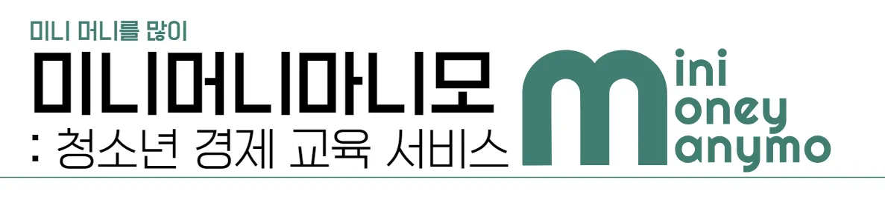

**minimoneymanymo**는 청소년 경제 교육 플랫폼으로, 서비스 내에서 받은 용돈을 통해 주식투자를 하며 경제 관념을 쌓습니다.

부모님이 서비스 내에서 용돈을 지급하면, 자녀는 용돈으로 실제 국내 주식의 장을 따라가는 시스템에 투자하여 자산을 관리합니다. 수익금에 대해 가상머니를 현금으로 출금할 수 있습니다.

서비스 내에서는 쉬운 경제 용어 설명, 투자 성향 분석, 뉴스, 퀴즈 등을 통해 자녀들이 자연스럽게 경제와 투자 개념을 습득할 수 있도록 돕습니다. 또한, 부모는 자녀의 투자 성향을 바탕으로 맞춤형 교육 방향을 설정할 수 있습니다.

 

# **기획 의도**

**미니머니마니모**는 청소년들이 용돈으로 경제적 사고와 책임감을 기를 수 있도록 하기 위해 기획되었습니다. 경제와 투자에 대한 개념을 자연스럽게 학습하게도록 하는 것을 목표로 합니다.

 

# 컨벤션

| **그라운드룰**                                                              | **컨벤션**                                                                 |
| --------------------------------------------------------------------------- | -------------------------------------------------------------------------- |
| [그라운드룰](https://www.notion.so/6d3fa32e0b8244cebff3130968f2e43a?pvs=21) | [🛠️ 컨벤션](https://www.notion.so/13f33d54ac3e443a95f4edf2c9802b58?pvs=21) |

 

# **기획 및 설계**

| **기능 명세서**                                                                                                        | **API 명세서**                                                              | **ERD 다이어그램**                                                |
| ---------------------------------------------------------------------------------------------------------------------- | --------------------------------------------------------------------------- | ----------------------------------------------------------------- |
| [📑 기능 명세서](https://docs.google.com/spreadsheets/d/1q-ugIvySBtwIpHrxqvXC6WgJG4h4FHFSlV-lz-28Lk8/edit?usp=sharing) | [🔌 API 명세서](https://documenter.getpostman.com/view/22680555/2sAXjNXWXQ) | [⚡ ERD 다이어그램](https://www.erdcloud.com/d/9wybv5mf6N8RpyrQB) |

 

# **시연 영상**

 

# 기술 스택

| Category                         | Details                              |
| -------------------------------- | ------------------------------------ |
| **Server**                       | Tomcat, Nginx, Node.js, Gradle 8.5   |
| **Language**                     | Java 17, TypeScript                  |
| **Framework**                    | SpringBoot 3.2, 18.3.1, Spring Batch |
| **Infra**                        | AWS(EC2, S3)                         |
| **Database**                     | PostgreSQL 16.4                      |
| **Caching**                      | Redis                                |
| **ORM**                          | JPA, Query DSL 5.0                   |
| **IDE**                          | Intellij, VS Code, Termius           |
| **Container**                    | Docker                               |
| **Authentication/Authorization** | JWT, Spring Security                 |
| **CI/CD**                        | Docker hub, Docker compose, Jenkins  |
| **Testing**                      | JUnit 5, AssertJ                     |
| **Team Collaboration Tool**      | Git, GitLab, Jira, Notion            |
| **Web APIs**                     | 한국투자증권 API, 네이버뉴스 API     |
| **AI/ML Services**               | GPT 3.5 Turbo                        |

 

# **프로젝트 소개 및 주요 기능**

## 📈 종목 대시보드

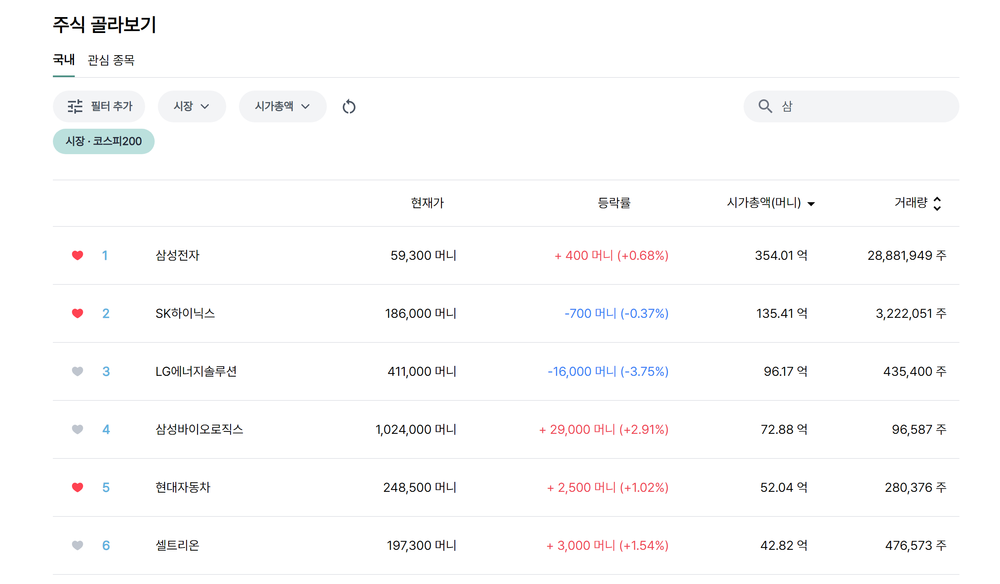

종목을 자유롭게 조회하고 및 필터, 검색, 관심 종목 등록할 수 있습니다.

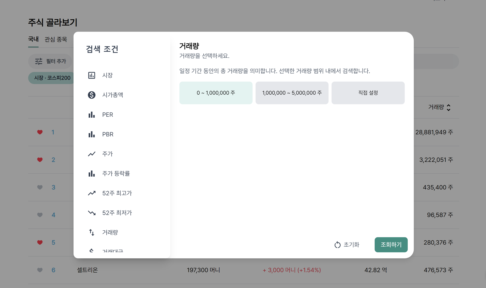
다양한 필터가 가능합니다.

## **🙋‍♀️ 모의 투자**

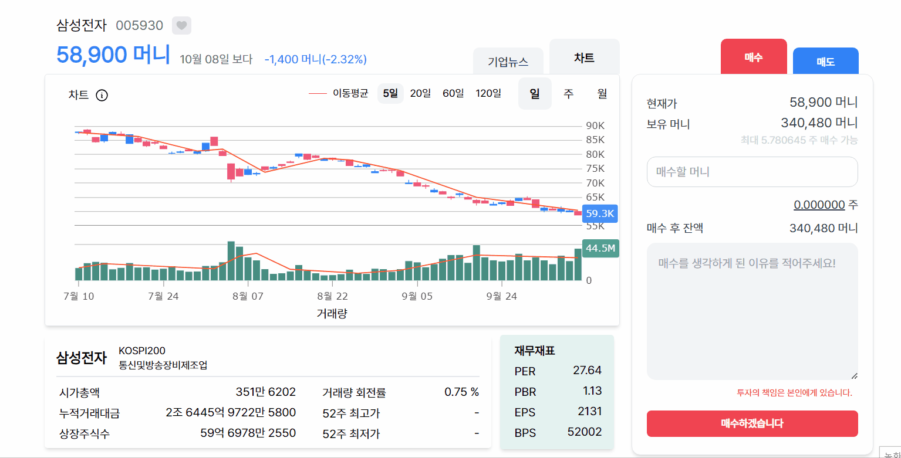

당일 종가 기준으로 거래가 진행되며, 한 주 가격이 높은 점을 고려하여 소수점 매매를 제공합니다.

자녀들이 보다 쉽게 투자를 할 수 있도록 일, 주, 월을 구분해 캔들 차트를 제공합니다.

매매 시에는 투자 이유를 반드시 작성해 신중한 투자 습관을 기르도록 하고, 후에 투자 이유를 복기하도록 합니다.

복잡한 경제 용어에 대한 이해를 돕기 위해 용어에 마우스를 올리면 쉽게 이해할 수 있는 설명을 제공하고, 사용자의 투자 성향을 분석하여 다른 사용자와 비교할 수 있는 자료를 제공합니다.

## **👩🏽‍🤝‍👩🏻 투자 교육**

경제 용어를 호버하면 각 용어에 대한 설명을 제공합니다.

매일 그 날에 작성된 5개의 경제뉴스가 메인에서 제공됩니다. 업데이트 되는 뉴스를 기반으로 AI를 통해 퀴즈를 생성합니다. 이 때, 정답을 맞추면 부모님이 설정한 퀴즈보상머니를 획득할 수 있어 자녀들이 경제 뉴스에 관심을 가질 수 있도록 동기부여합니다.

## **📷 자녀 관리**

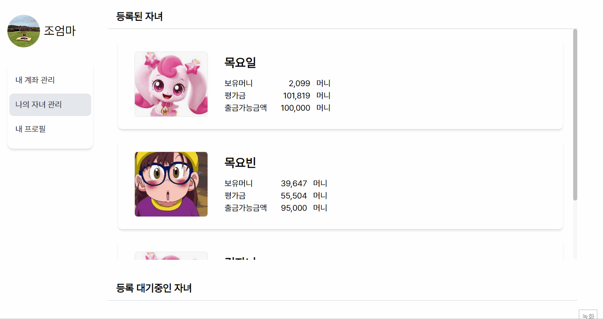

부모님은 자녀의 투자과정을 전체적으로 모니터링 할 수 있습니다. 부모의 마이페이지에서 나의 자녀 관리 탭을 통해 자녀를 한 눈에 확인할 수 있고, 각 자녀 별로 자금관리, 투자성향, 일기체크를 할 수 있습니다

### 자금 관리

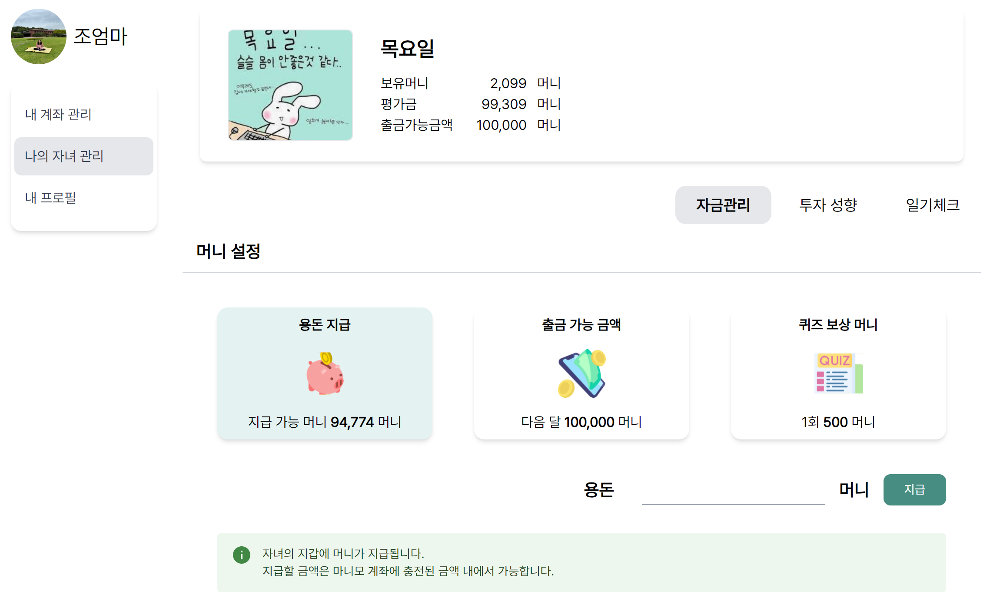

자금관리에서는 자녀가 서비스 내에서 사용할 한 달 용돈, 투자 이익을 얻었을 때 가상 머니를 현금화할 수 있는 한도인 출금가능금액, 퀴즈를 맞췄을 때 제공할 퀴즈 보상 머니 금액을 설정할 수 있습니다.

### 투자 성향 및 분석

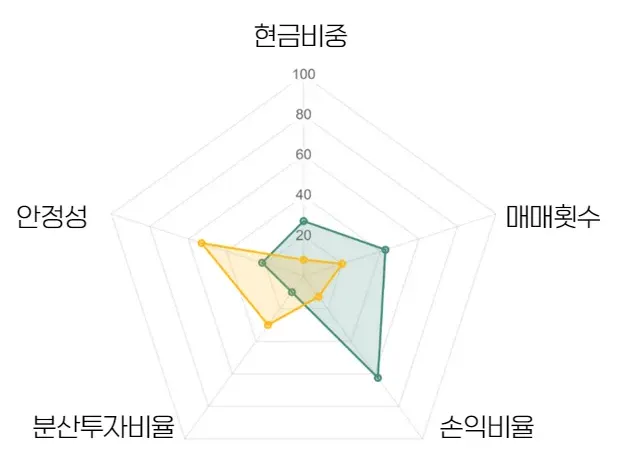

총 다섯 개의 기준으로 분석 그래프를 제공합니다.

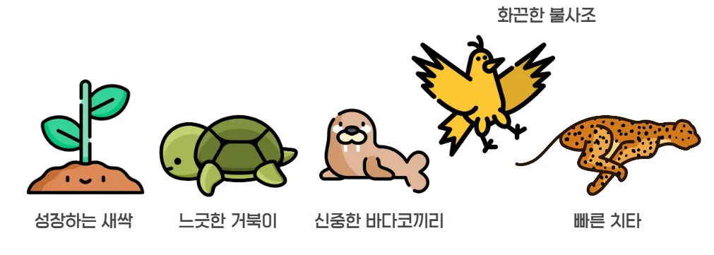

자녀의 투자 기록을 바탕으로 5가지 투자 성향이 제공됩니다.

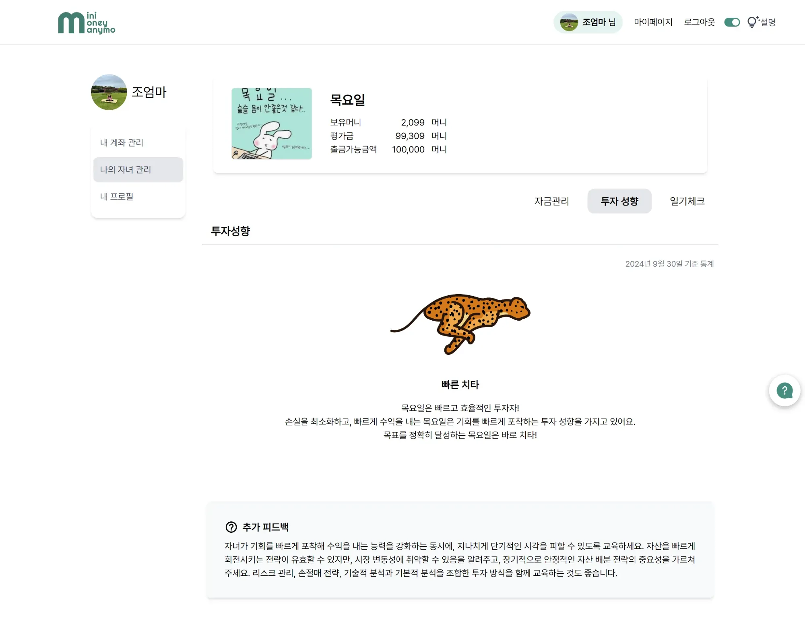

제공된 투자 성향을 바탕으로 자녀의 경제 교육을 어떻게 진행해야 하는 지에 대해 팁을 제공합니다.

### 투자 일기

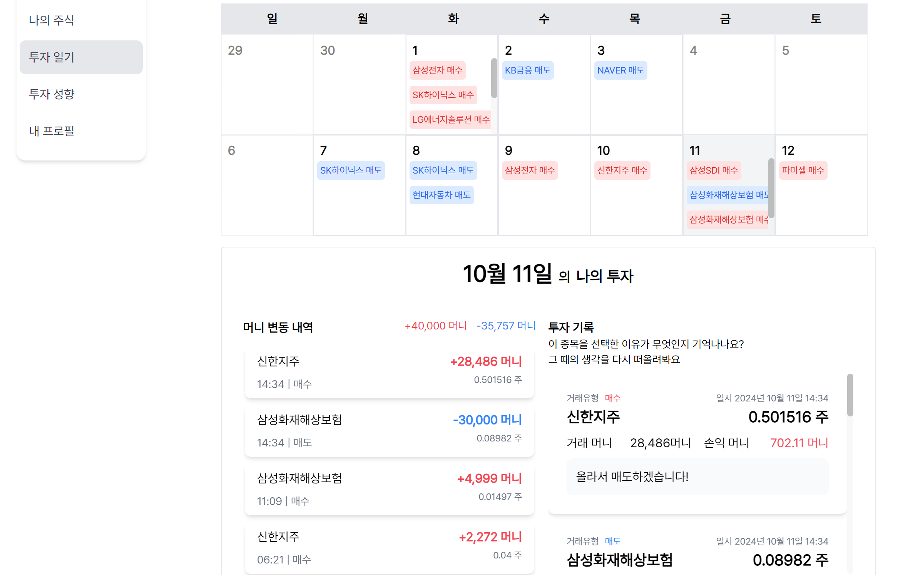

자녀와 부모는 투자 일기를 보며 그간의 투자를 복기할 수 있습니다.

 

# 주요 기술

## 배치 시스템

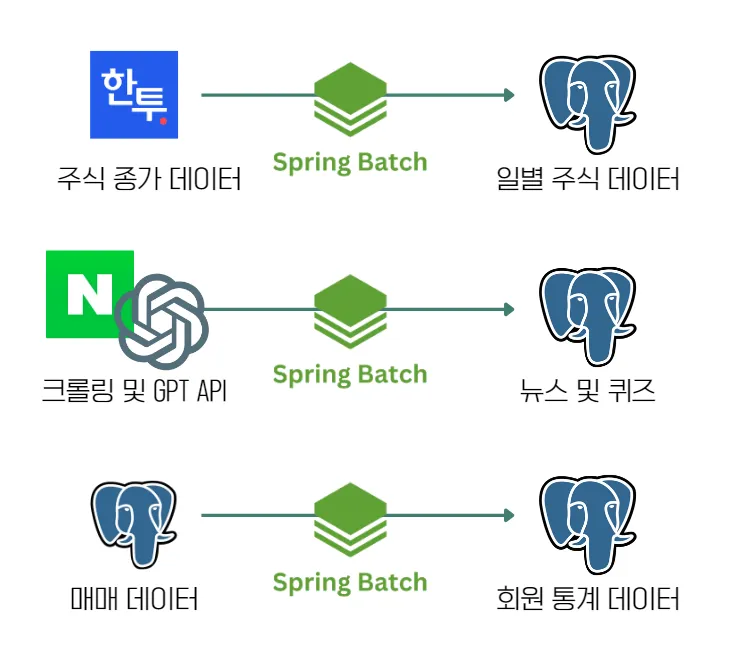

기간별 데이터를 수집하기 위한 배치 시스템을 구현했습니다. 총 3건의 Job으로 구성됩니다.

## 군집화

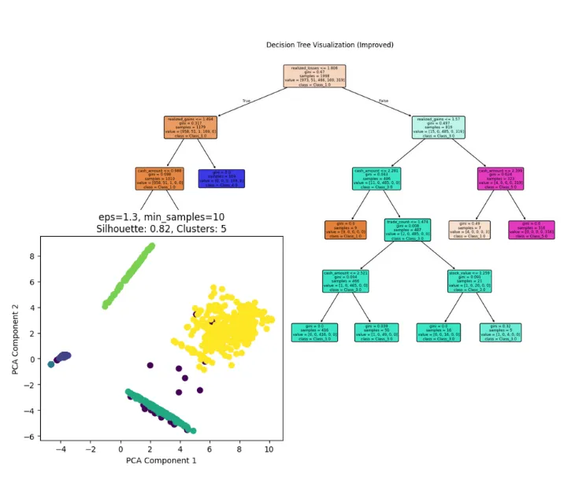

군집화를 위해 DBSCAN 알고리즘을 도입했고, Random Forest 모델을 통해 각 군집별 특징을 도출했습니다.

## 캐싱 및 검색엔진

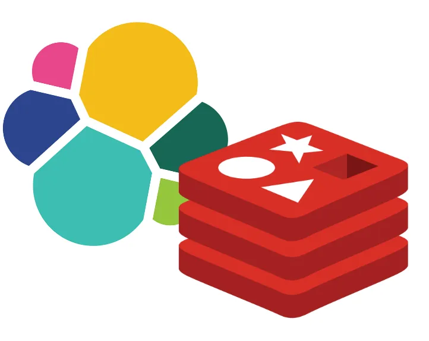

자동 검색어 기능을 위헤 Elasticsearch를 도입했으며, 복잡한 쿼리에 대한 캐싱을 위해 Redis를 사용했습니다.

 

# 역할 분담

  <table>
  <tr>
      <td align="center">
        
      </td>
      <td align="center">
        
      </td>
      <td align="center">
        
      </td>
      <td align="center">
        
      </td>
      <td align="center">
        
      </td>

  </tr>
  <tr>
    <td align="center">
      <a href="https://github.com/joareum">
        조아름
      </a>
    </td>
    <td align="center">
      <a href="https://github.com/seminss">
        김세민
      </a>
    </td>
    <td align="center">
      <a href="https://github.com/yobinmok">
        목요빈
      </a>
    </td>
    <td align="center">
      <a href="https://github.com/2dayoung">
        이다영
      </a>
    </td>
    <td align="center">
      <a href="https://github.com/changhyeon12333">
        이창현
      </a>
    </td>
  </tr>
  <tr>
    <td align="center">
      BE, FE
    </td>
    <td align="center">
      BE, FE
    </td>
    <td align="center">
      BE, FE
    </td>
    <td align="center">
      BE, FE
    </td>
    <td align="center">
      BE, FE, Infra
    </td>
  </tr>
</table>

### **🐶 조아름 (팀장)**

- 투자
  - 매수 매도 로직 개발
  - 종목 검색 기능 개발
- 주식
  - 검색 기능 개발

### **🐰 김세민 (BE 리더)**

- 주식

  - 5년치 주식 데이터 수집
  - 일별 주식 데이터 수집 배치 시스템 개발
  - 차트 쿼리 및 캐싱, API 개발
  - 종목 대시보드 API 및 화면 개발

- 통계 및 성향
  - 회원 통계 및 성향 분석 배치 시스템 개발
  - 회원 군집화 및 군집별 성향 도출

### **🦔 목요빈**

- 자금 관리
  - 금융 API 연동
  - API 및 화면 개발

### **😺 이다영 (FE 리더)**

- 주식
  - 차트 및 매매 화면 개발
- 자금 관리
  - 투자 일기 화면 개발
  - 머니 설정 API 및 화면 개발

### **🐺 이창현**

- 회원 관리
- 퀴즈
  - 크롤링 및 퀴즈 생성 배치 시스템 개발
  - API 및 화면 개발
- 인프라 구성 및 배포

 

# **아키텍처**

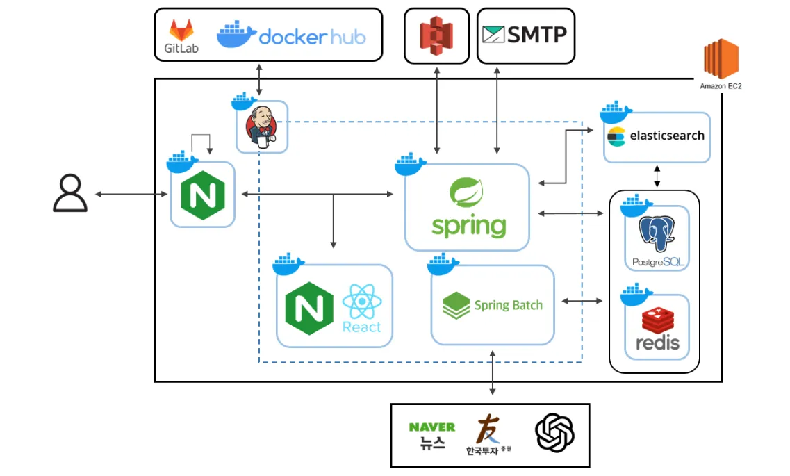
